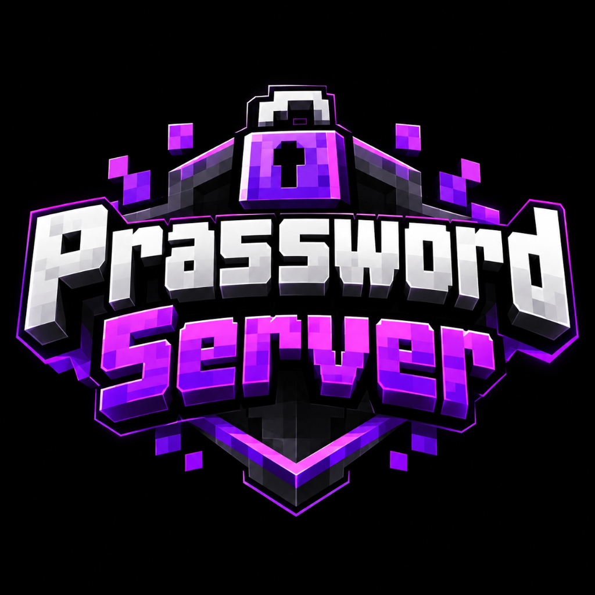

<p align="center">
  
</p>

<h1 align="center">🔐 ServerPassword (Prassword Server)</h1>

<p align="center">
  <strong>ปลั๊กอินระบบรหัสผ่านกลางป้องกันเซิร์ฟเวอร์ Minecraft ที่ออกแบบมาเพื่อสตรีมเมอร์และคอมมูนิตี้</strong><br>
  รองรับทั้ง <b>Java Edition</b> และ <b>Bedrock Edition (Geyser / Floodgate)</b>
</p>

<p align="center">
  
  
  
  
</p>

<p align="center">
  <a href="https://discord.com/users/435412527548203028">
    
  </a>
</p>

---

## 🌟 จุดเด่นที่ไม่เหมือนใคร (Why ServerPassword?)

ในเซิร์ฟเวอร์ทั่วไป เมื่อสตรีมเมอร์ไลฟ์สด ผู้ชมมักจะเห็นรหัสผ่านจากการพิมพ์ที่มุมจอหรือการคลิก UI **ServerPassword** ถูกพัฒนาขึ้นเพื่อแก้ปัญหานี้โดยเฉพาะ:

* ⚡ **Remember Player (ใส่ครั้งเดียวจบ):** ผู้เล่นหรือสตรีมเมอร์ใส่รหัสผ่านครั้งแรกเพียงครั้งเดียว (ทำนอกสตรีม) ระบบจะจำ UUID ถาวร ครั้งต่อไปเวลาเปิดสตรีมสดเข้าเล่น จะเข้าเซิร์ฟเวอร์ได้ทันที 100% **ไม่มีกล่องข้อความ ไม่มีคำเตือน และไม่มีอะไรขึ้นหน้าจอเลย!**
* 🤫 **Zero-Leak Protection (ไม่มีรหัสหลุด):** เมื่อพิมพ์รหัสในแชต ข้อความจะไม่ถูกส่งออกสู่สาธารณะ และระบบจะล้างหน้าจอแชต (Auto Clear Chat) ทันทีหลังส่ง
* 📱 **Full Bedrock & Java Crossplay:** รองรับทั้งผู้เล่นคอมพิวเตอร์และมือถือผ่าน GeyserMC
* 🔒 **ระบบล็อกตัวผู้เล่น (Anti-Bypass Freeze):** ป้องกันการเดิน, กระโดด, ทุบ/วางบล็อก, และป้องกันดาเมจ 100% จนกว่าจะยืนยันรหัสถูกต้อง
* ⏱️ **ระบบรักษาความปลอดภัย:** เตะอัตโนมัติเมื่อใส่ผิดเกินจำนวนครั้ง หรือปล่อยทิ้งไว้หมดเวลา

---

## 📦 วิธีติดตั้ง (Installation)

1. ดาวน์โหลดไฟล์ [ServerPassword-1.0.0.jar](ServerPassword-1.0.0.jar)
2. นำไฟล์ไปวางในโฟลเดอร์ `plugins/` ของเซิร์ฟเวอร์คุณ (Paper / Purpur / Spigot 1.17 - 1.21+)
3. เริ่มต้นหรือรีสตาร์ตเซิร์ฟเวอร์
4. แก้ไขรหัสผ่านได้ที่ `plugins/ServerPassword/config.yml` (ค่าเริ่มต้น: `12345678`)

---

## 🎮 คำสั่งและการใช้งาน (Commands & Permissions)

| คำสั่ง (Command) | คำอธิบาย (Description) | สิทธิ์ (Permission) |
| :--- | :--- | :--- |
| พิมพ์รหัสในช่องแชตโดยตรง | ใส่รหัสผ่านเข้าเซิร์ฟเวอร์ (สำหรับผู้เล่นใหม่) | ทุกคน |
| `/serverpass submit <รหัส>` | ส่งรหัสผ่านผ่านคำสั่งสำรอง (หรือ `/pass <รหัส>`) | ทุกคน |
| `/serverpass gui` | เปิดหน้าต่างตู้เซฟ Keypad PIN Pad | ทุกคน |
| `/serverpass set <รหัสใหม่>` | เปลี่ยนรหัสผ่านเซิร์ฟเวอร์ (และรีเซ็ตทุกคนให้ใส่ใหม่) | `serverpassword.admin` (OP) |
| `/serverpass reset <ชื่อผู้เล่น>` | บังคับให้ผู้เล่นคนนั้นต้องใส่รหัสผ่านใหม่อีกครั้ง | `serverpassword.admin` (OP) |
| `/serverpass resetall` | บังคับให้ผู้เล่นทุกคนต้องใส่รหัสผ่านใหม่อีกครั้ง | `serverpassword.admin` (OP) |
| `/serverpass list` | ตรวจสอบจำนวนผู้เล่นที่ผ่านการยืนยันแล้ว | `serverpassword.admin` (OP) |
| `/serverpass reload` | รีโหลดการตั้งค่าทั้งหมดจาก `config.yml` | `serverpassword.admin` (OP) |

---

## ⚙️ ตัวอย่างการตั้งค่า (`config.yml`)

```yaml
# รหัสผ่านเซิร์ฟเวอร์ (1-8 ตัวอักษรหรือตัวเลข)
server-password: "12345678"

# ระบบจดจำผู้เล่น (ใส่ครั้งเดียว ครั้งถัดไปไม่ต้องใส่เลย)
remember-player:
  enabled: true
  reset-on-password-change: true # รีเซ็ตทุกคนเมื่อแอดมินเปลี่ยนรหัสผ่าน

# รูปแบบการใส่รหัส: "CHAT" หรือ "GUI"
input-mode: "CHAT"

# การตั้งค่าความเนียนสำหรับสตรีมเมอร์
stealth:
  clear-chat-on-submit: true  # ล้างแชตทันทีหลังกดส่ง
  blindness: false             # false = จอสว่างปกติ ไม่มืดดำ
  freeze: true                 # ล็อกตัวไม่ให้เดินก่อนใส่รหัส
  prompt-type: "ACTIONBAR"     # "ACTIONBAR" (ข้อความเล็กๆ เหนือหลอดเลือด)

max-attempts: 3
timeout-seconds: 60
```

---

## 👨‍💻 ผู้พัฒนา (Developer)

* **Lead Developer:** **KaFulnwza007** (KaFuCraft)
* **Discord:** `kafu_craft` (User ID: `435412527548203028`)
* **YouTube:** [Kafu Craft](https://www.youtube.com)

---

## 📄 ลิขสิทธิ์ (License)

โปรเจกต์นี้เผยแพร่ภายใต้สัญญาอนุญาต [MIT License](LICENSE) - สามารถนำไปใช้งาน ปรับแต่ง และพัฒนาต่อได้อย่างอิสระโดยคงเครดิตผู้พัฒนาเดิม
